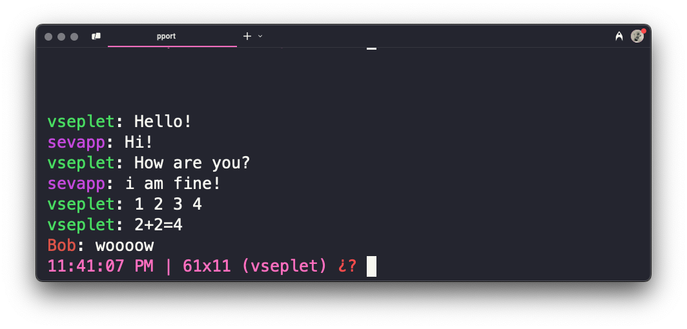

# PPORT — Text-Based Messenger for the Command Line



[Join the discussion on Hacker News!](https://news.ycombinator.com/item?id=43804324)

> To start using PPORT, simply visit [pport.top](https://pport.top) and follow
> the instructions.

## Why?

PPORT is a small experimental project where I explore the simplest and fastest
way to deliver software (specifically CLI utilities) over plain HTTP.

To test this method, I built a lightweight text-based chat application that runs
directly in the terminal.

## Tech Stack

The core language is TypeScript. Usually, language choice for me is a matter of
taste (especially for projects like this), but in this case, I specifically
chose TypeScript because of **Deno**.

Deno is a fantastic JavaScript runtime that offers two critical features:

- **Import and run scripts directly from URLs**.
- **Transpile TypeScript on the fly** without any additional build steps.

Since I chose Deno, it made perfect sense to deploy PPORT on **Deno Deploy**.
This hosting platform allows almost instant deployment simply by connecting a
GitHub repository. Because Deno doesn't rely on Docker, projects on Deno Deploy
go live within seconds after a commit/push.

## How does it work?

All that is required to distribute this CLI utility is a basic **HTTP server**
and a standard **HTTP client** (like `curl` or `irm`), which is available on
almost every machine.

The magic happens in `server.ts`, a script that performs several important
tasks:

1. Serves a web page with instructions when accessed from a browser.
2. Serves an installer script (`.sh` for Unix, `.ps1` for Windows) if the
   request comes with a `User-Agent` from `curl` or `irm`.
3. Serves `.ts` files (e.g., `source/client.ts`) if the request comes with a
   `User-Agent` from Deno.

When you run:

```bash
curl -fsSL pport.top | sh
```

the following sequence happens:

- The server detects the `User-Agent` from `curl` and responds with a shell
  installer script.
- The shell script checks if Deno is installed (and installs it if needed).
- It then runs `deno install`, triggering further requests to `pport.top`.
- The server, seeing the `User-Agent` from Deno, responds by serving the
  required `.ts` source files.

\
\
Simple as that.

---

[LICENSE](./LICENSE)
